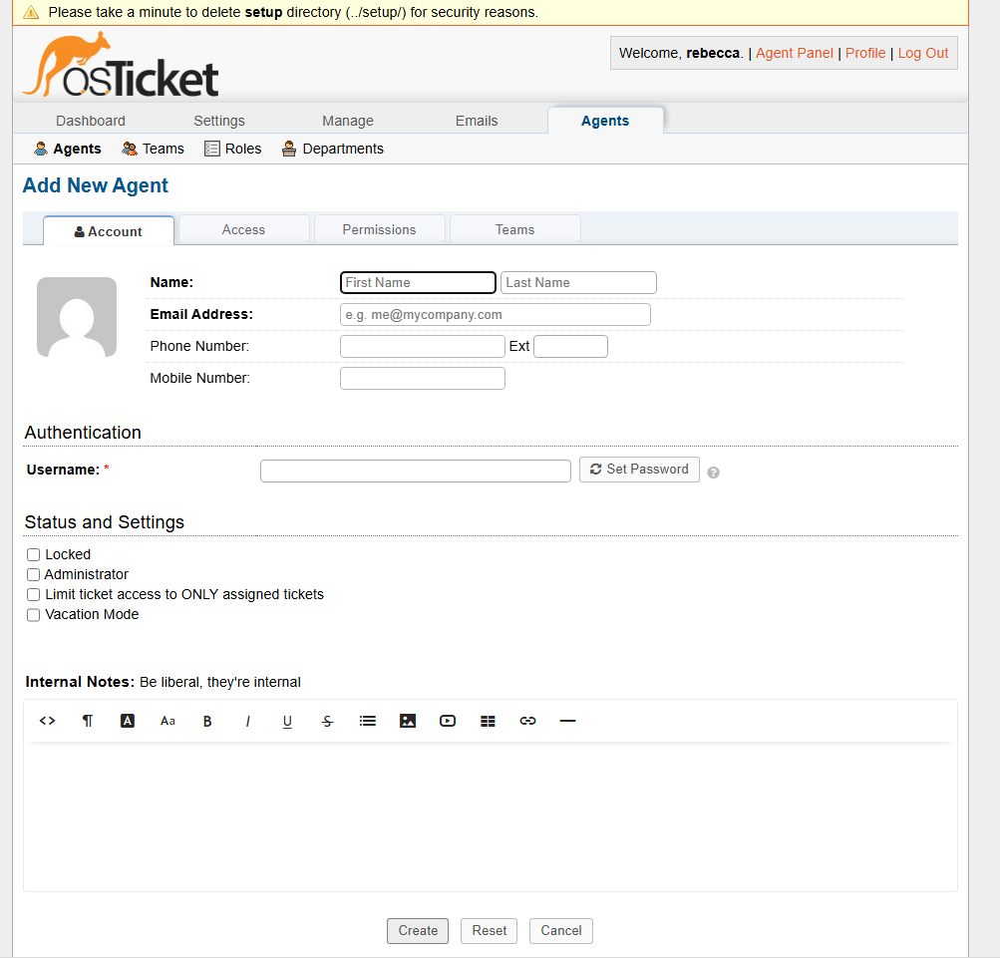
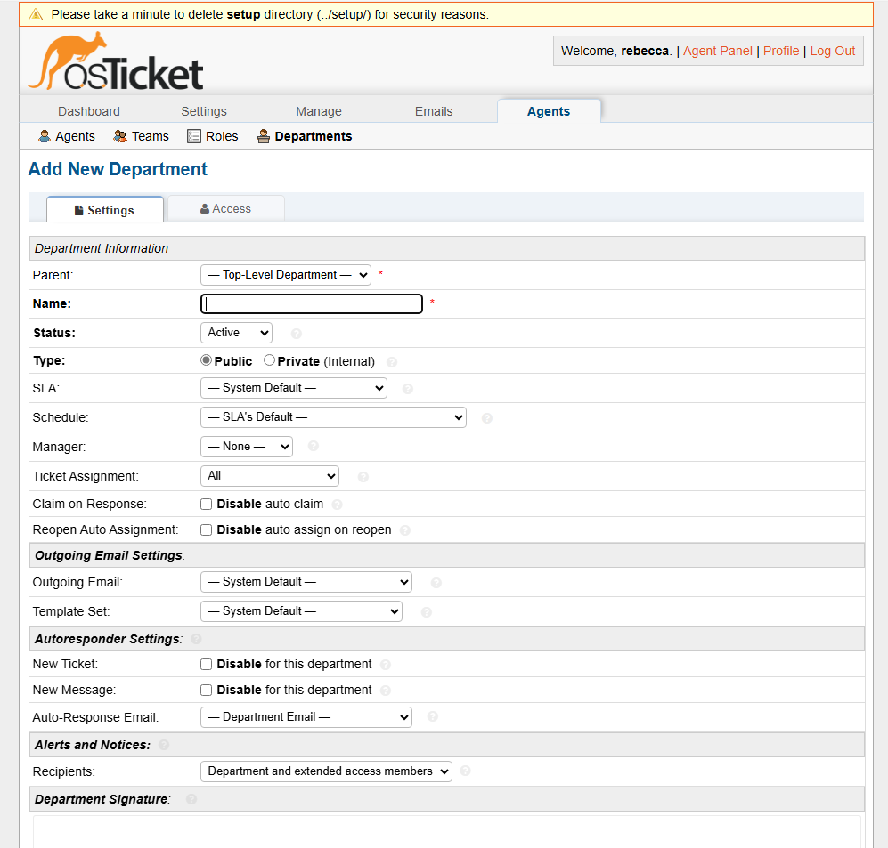
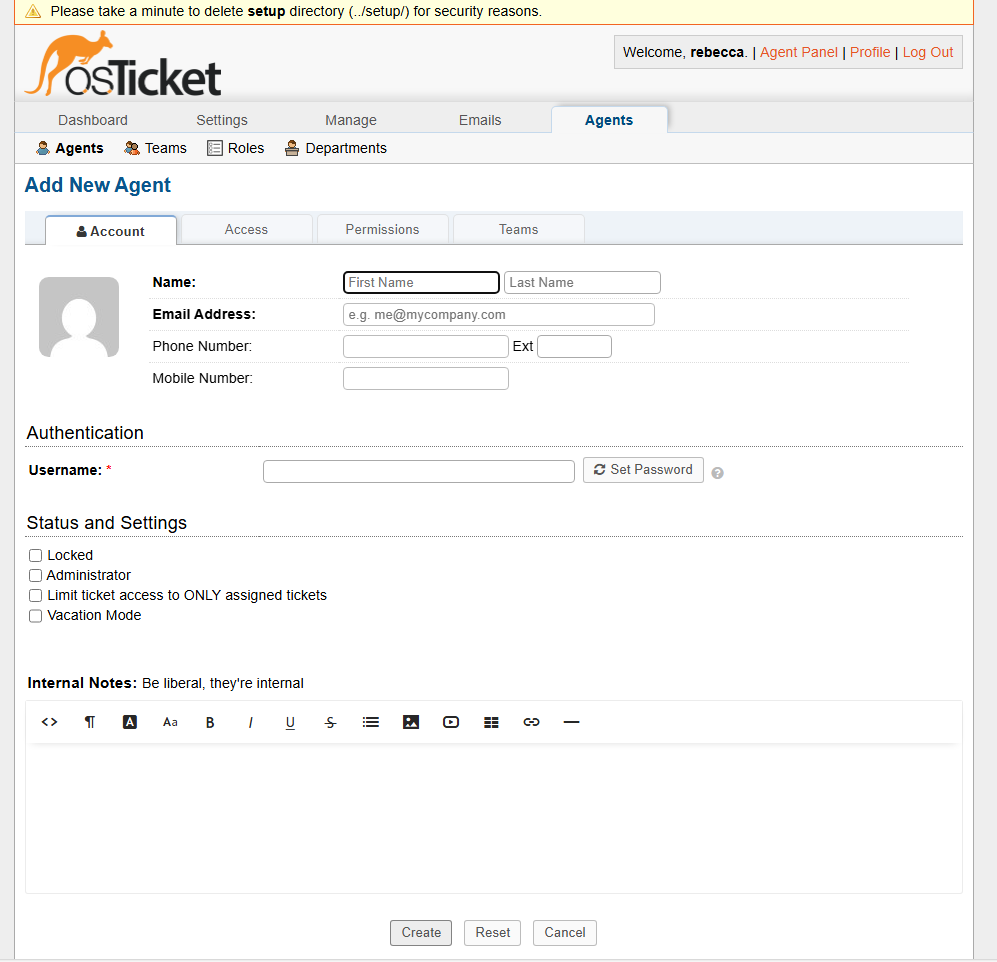
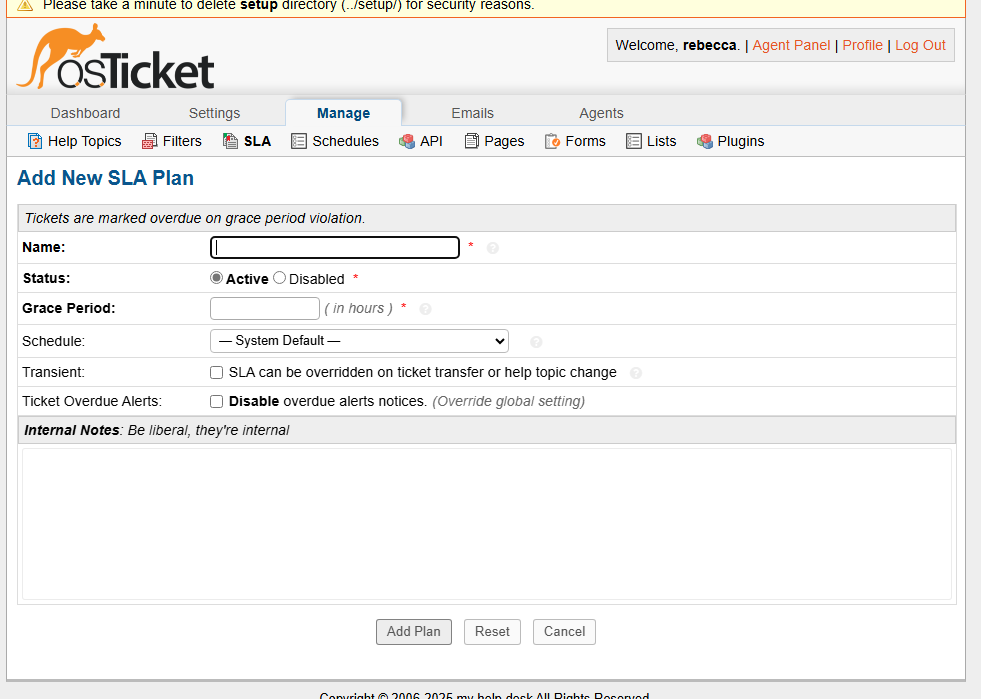
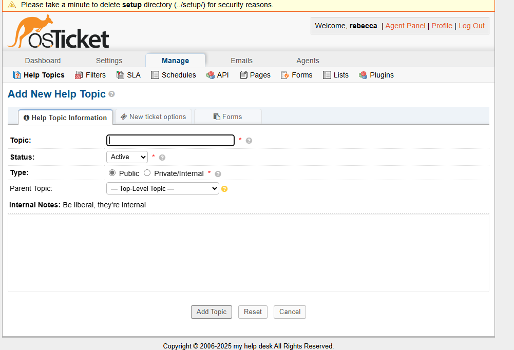

# post-install-config

<h1>osTicket - Post-Install Configuration</h1>
This tutorial outlines the post-install configuration of the open-source help desk ticketing system osTicket. 

<h2>Environments and Technologies Used</h2>

- Microsoft Azure (Virtual Machines/Compute)
- Remote Desktop
- Internet Information Services (IIS)

<h2>Operating Systems Used </h2>

- Windows 10</b> (21H2)

<h2>Post-Install Configuration Objectives</h2>

create head admin role in permissions
configure desired departments
configure desired teams
configure workers
configure customers
configure sla
configure desired help topics

<h2>Configuration Steps</h2>

Page to configure new agents

page to configure departments
  

Add new Agents
  

SLA plan

Help topics

